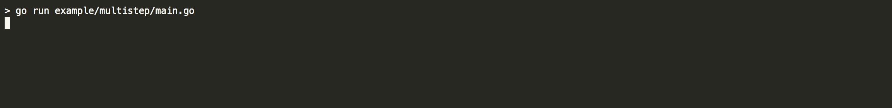

prettyprogress
====

a tiny library for printing nice-looking console progress

# Quick Start

See [example/multistep/main.go](example/multistep/main.go) for the main API, or [example/simple/main.go](example/simple/main.go) for UI-only structs

# Features:

 - Nice unicode icons
 - Colors! Animated Bullets!
 - Multiple parallel steps
 - Unicode progress bars with smooth-scrolling (inspired by [this blog post](https://mike42.me/blog/2018-06-make-better-cli-progress-bars-with-unicode-block-characters))
 - Simple, composable API: just prints itself, use e.g. [uilive](https://github.com/gosuri/uilive) for animation
 - Basic [UI-only package](https://godoc.org/github.com/julz/prettyprogress/ui) if you just want to print a nice progress bar or grab a pretty unicode icon

# Example:

Output from [/example/multistep/main.go](example/multistep/main.go):

