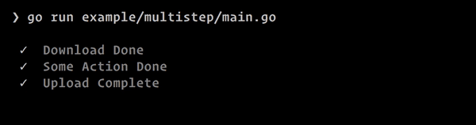

prettyprogress
====

a tiny library for printing nice-looking console progress

# Quick Start

See [example/simple/main.go](example/simple/main.go).

# Features:

 - Nice unicode icons
 - Multiple parallel steps
 - Unicode progress bars with smooth-scrolling via box-drawing characters (inspired by [this blog post](https://mike42.me/blog/2018-06-make-better-cli-progress-bars-with-unicode-block-characters))
 - Simple, composable API: just prints itself, use e.g. [uilive](https://github.com/gosuri/uilive) for animation
 - Thread-safe multi-step `updater` sub-package (see [/examples/multistep/main.go](example/multistep/main.go))

# Example:

Output from [/example/multistep/main.go](example/multistep/main.go):

